# Звіт з лабораторної роботи 2

## Тема роботи: Аутентифікація, авторизація та розширений функціонал

Здобувач освіти: Маляр Вероніка Володимирівна
Група: ІПЗ-42
GitHub репозиторій: https://github.com/veronikamaliar/timeplanner-app2.git
Рівень складності: 3

## Реалізований функціонал

У результаті виконання лабораторної роботи було виконано завдання 1 рівня, а саме: систему реєстрації користувачів з валідацією даних, безпечне зберігання паролів за допомогою bcrypt, систему аутентифікації на основі JWT токенів, middleware для перевірки автентифікації користувачів, базову систему ролей користувачів, middleware авторизації для захисту окремих маршрутів, пагінацію для списків даних, документацію API за допомогою Swagger.

Також було реалізовано такі функції як:
- Файловий сервіс для завантаження та зберігання файлів
- Валідацію типів та розмірів файлів
- Систему пошуку по основних сутностях предметної області
- Фільтрацію даних за різними критеріями
- Можливість видалення завантажених файлів
- Endpoint для зміни паролю користувача
- Refresh токени для оновлення JWT
- Систему відновлення паролю через email
- Rate limiting для захисту від зловживань
- Розширену документацію API з прикладами використання та опис всіх можливих помилок.

## Ключові фрагменти коду

### Реєстрація користувача
```
async function register(req, res) {
    try {
        const { email, password, name } = req.body;

        if (!email || !password || !name) {
            return res.status(400).json({
                error: 'Email, пароль та ім\'я є обов\'язковими'
            });
        }

        if (password.length < 8) {
            return res.status(400).json({
                error: 'Пароль має містити мінімум 8 символів'
            });
        }

        const existingUser = await prisma.user.findUnique({
            where: { email }
        });

        if (existingUser) {
            return res.status(409).json({
                error: 'Користувач з таким email вже існує'
            });
        }

        const hashedPassword = await hashPassword(password);

        const { role } = req.body;
        const user = await prisma.user.create({
            data: {
                email,
                password: hashedPassword,
                name,
                role: role || 'USER'
            },
            select: {
                id: true,
                email: true,
                name: true,
                role: true,
                createdAt: true
            }
        });

        const accessToken = generateAccessToken(user.id, user.role);
        const refreshToken = generateRefreshToken(user.id);

        res.status(201).json({
            message: 'Користувача успішно зареєстровано',
            user,
            tokens: {
                accessToken,
                refreshToken
            }
        });

    } catch (error) {
        console.error('Помилка реєстрації:', error);
        res.status(500).json({
            error: 'Помилка сервера при реєстрації'
        });
    }
}
```
### Middleware для аутентифікації
```
const { verifyAccessToken } = require('../utils/jwt');

function authenticate(req, res, next) {
    try {
        const authHeader = req.headers.authorization;

        if (!authHeader || !authHeader.startsWith('Bearer ')) {
            return res.status(401).json({
                error: 'Токен аутентифікації відсутній'
            });
        }

        const token = authHeader.substring(7);
        const decoded = verifyAccessToken(token);

        req.user = decoded;
        next();
    } catch (error) {
        return res.status(401).json({
            error: 'Недійсний або прострочений токен'
        });
    }
}

module.exports = { authenticate };
```
### Схема та параметри для категорій
```
/**
 * @swagger
 * components:
 *   schemas:
 *     Category:
 *       type: object
 *       required:
 *         - name
 *       properties:
 *         id:
 *           type: integer
 *           description: Унікальний ідентифікатор категорії
 *           example: 1
 *         name:
 *           type: string
 *           description: Назва категорії
 *           example: "Work"
 */

/**
 * @swagger
 * tags:
 *   name: Categories
 *   description: Операції з категоріями
 */

/**
 * @swagger
 * /api/categories:
 *   get:
 *     summary: Отримати всі категорії
 *     tags: [Categories]
 *     parameters:
 *       - in: query
 *         name: page
 *         schema:
 *           type: integer
 *           default: 1
 *         description: Номер сторінки
 *       - in: query
 *         name: limit
 *         schema:
 *           type: integer
 *           default: 10
 *         description: Кількість елементів на сторінку
 *       - in: query
 *         name: order
 *         schema:
 *           type: string
 *           enum: [asc, desc]
 *           default: asc
 *         description: Порядок сортування
 *     responses:
 *       200:
 *         description: Список усіх категорій
 *       500:
 *         description: Внутрішня помилка сервера
 */
router.get("/", getAllCategories);
```

### Пошук, фільтрація та сортування завдань
```
const getAllTasks = async (req, res) => {
  try {
    const {
      page = 1,
      limit = 10,
      search,
      categoryId,
      priority,
      completed,
      sortBy = 'createdAt',
      order = 'desc'
    } = req.query;

    const skip = (parseInt(page) - 1) * parseInt(limit);

    const where = {};

    if (search) {
      where.OR = [
        { title: { contains: search, mode: 'insensitive' } },
        { description: { contains: search, mode: 'insensitive' } },
      ];
    }

    if (categoryId) where.categoryId = parseInt(categoryId);

    if (priority) where.priority = priority;

    if (completed !== undefined) where.completed = completed === 'true';

    const orderBy = {};
    orderBy[sortBy] = order;

    const [tasks, total] = await Promise.all([
      prisma.task.findMany({
        where,
        include: { category: true, user: { select: { id: true, name: true, email: true } } },
        skip,
        take: parseInt(limit),
        orderBy
      }),
      prisma.task.count({ where })
    ]);

    res.json({
      data: tasks,
      pagination: {
        page: parseInt(page),
        limit: parseInt(limit),
        total,
        totalPages: Math.ceil(total / parseInt(limit)),
        hasMore: skip + tasks.length < total
      }
    });

  } catch (error) {
    console.error("Get tasks error:", error);
    res.status(500).json({ error: "Internal server error" });
  }
};
```


## Скріншоти
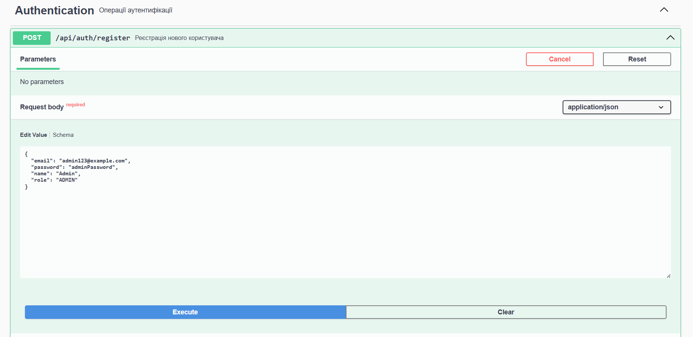

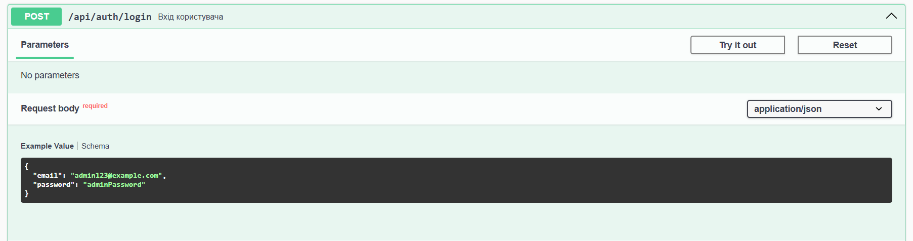
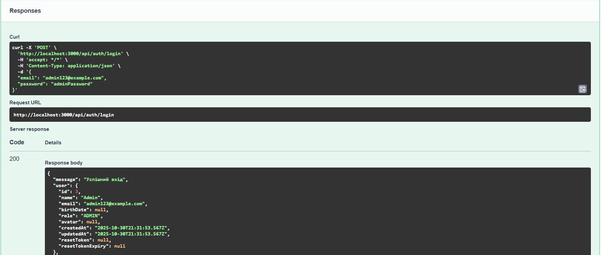
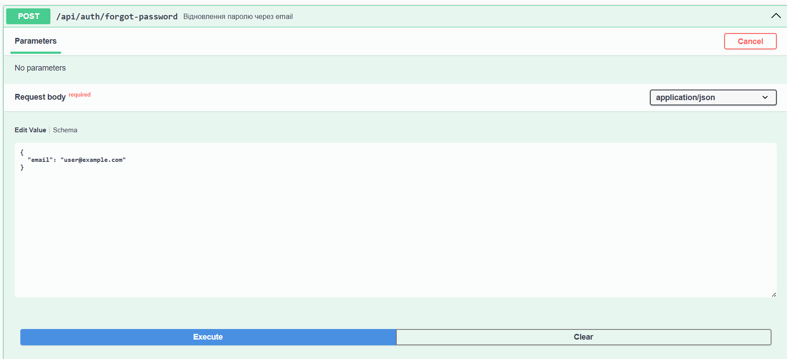
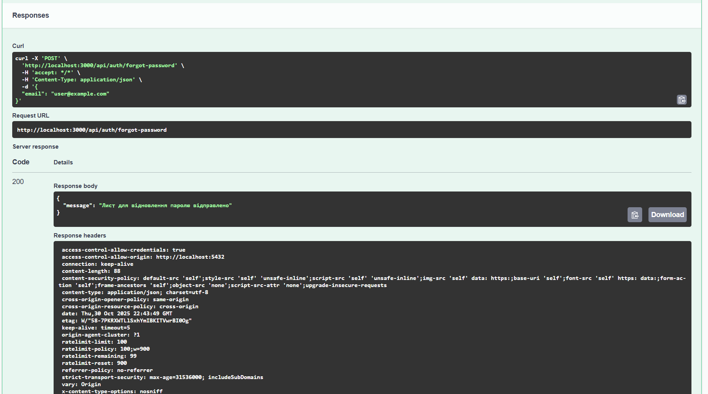
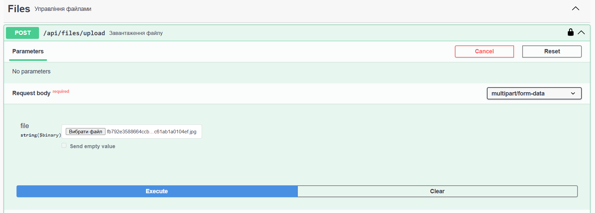
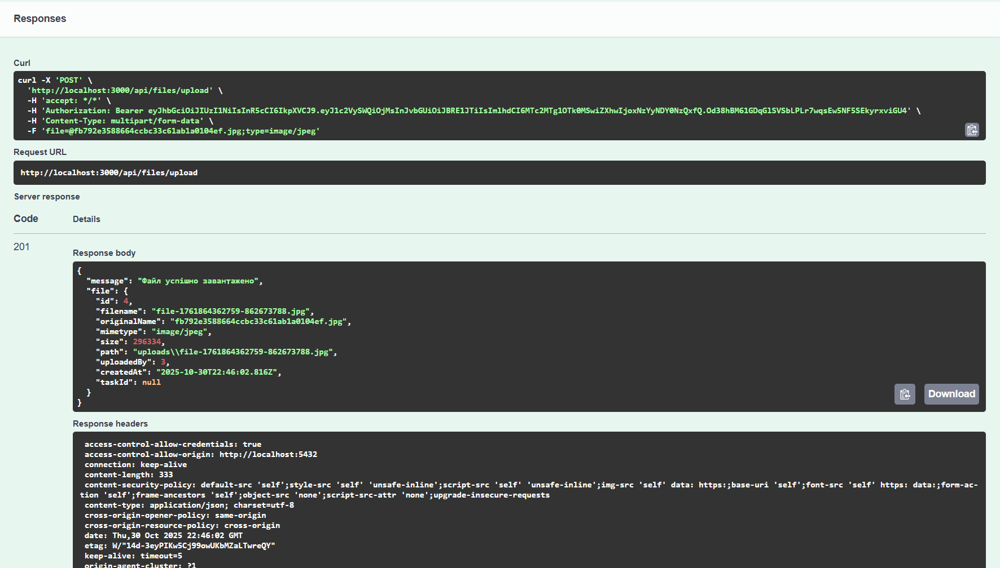
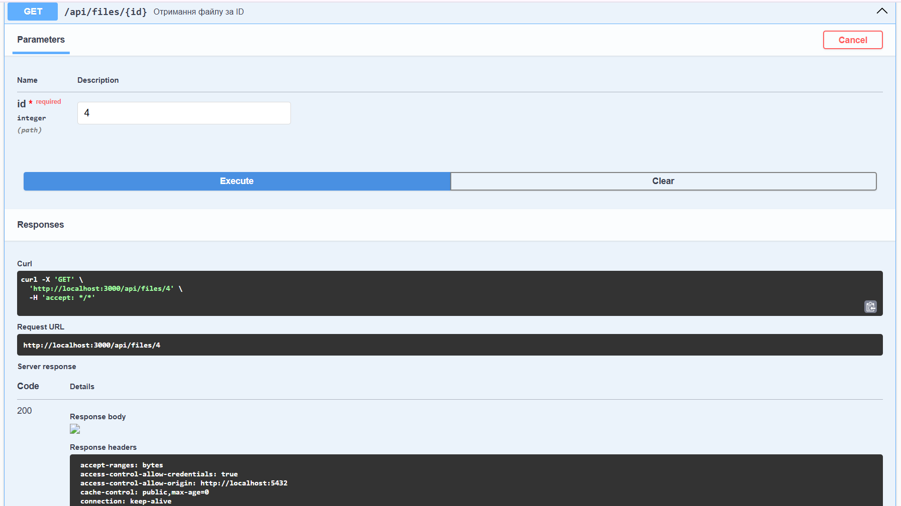
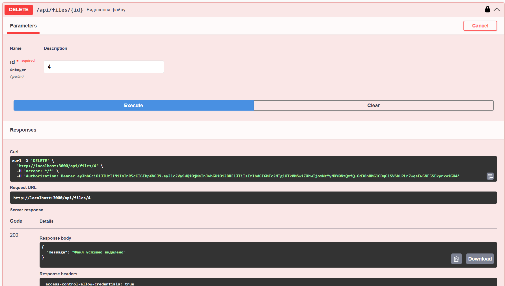
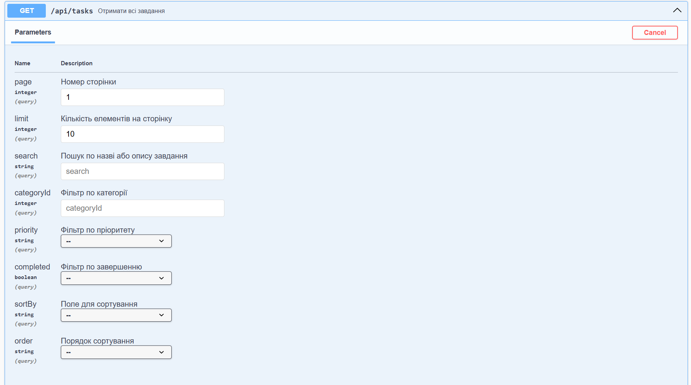

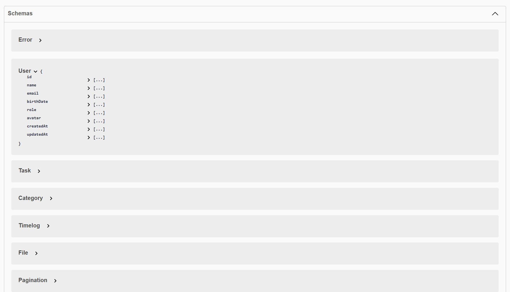

## Висновки

Самооцінка: 5

Обгрунтування: Виконано всі завдання рівнів 1 та 2, реалізовано додаткові функції з рівня 3. А також впроваджено комплексну систему безпеки з helmet, rate limiting, CORS; cтворено детальну документацію API з прикладами для всіх endpoints.
